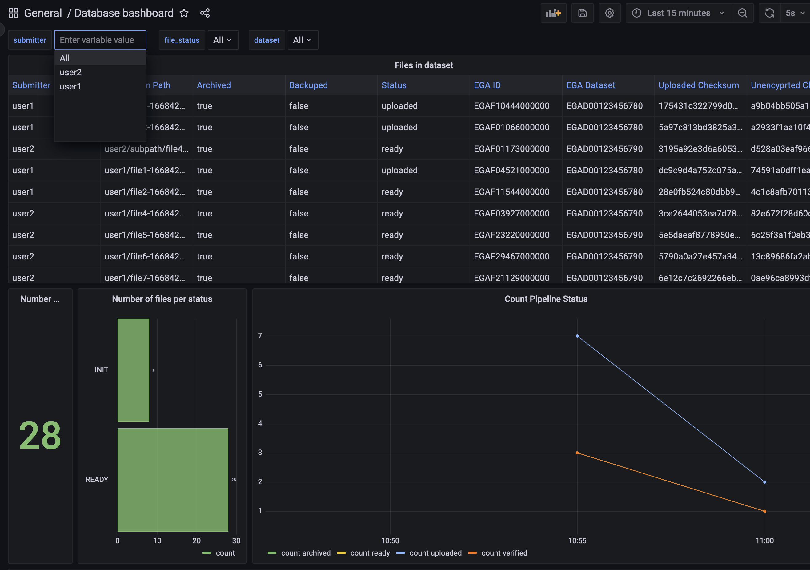

<!--

The paper.md, bibtex and figure file can be found in this repo:

  https://github.com/journal-of-research-objects/Example-BioHackrXiv-Paper

To modify, please clone the repo. You can generate PDF of the paper by
pasting above link (or yours) in

  http://biohackrxiv.genenetwork.org/

-->

# Introduction

Human genome and phenome data is classified as special categories under the EU
GDPR legislation and this requires special care to be taken when using and
re-using this data for research. To enable this in a compliant way the
Federated EGA was established in 2022[TODO citation]. The Federated EGA is
built on top of the already existing European Genome/Phenome Arcive (EGA). The
nordic countries, Norway, Finland and Sweden together with Spain and Germany
represent the first federated partners.

In the nordics we have collaborated around our own implementation for our
federated EGA nodes, we have done this under the umbrella of the Nordic
e-Infrastructure Collaboration (NeIC)[https://neic.no/] where we've had three
projects over the last 7 years, [Tryggve1](https://neic.no/tryggve1/)
[@tryggve1], [Tryggve2](https://neic.no/tryggve2/) [@tryggve2] and now
[Heilsa](https://neic.no/heilsa) [@heilsa].

As we in the nordics now move into production there is a need for both System
Administrators and Helpdesk staff to be able to control and inspect the system.
We need to answer questions related to operations, identify errors in order to
better manage the services and infrastructure. To standardize this workflow and
make the system easier to use we decided to build an MVP for such an “Operator
Dashboard” during the Elixir Biohackathon 2022.

# Results

We used [grafana](https://grafana.com) [TODO: cite] to create a Minimal Viable
Product (MVP) of a dashboard to view the current state of the systema and to
give some simple
interaction points with system.

There are two main views into the system. The first one is an overview over all
files and what state they are in, whether they have been moved from the inbox,
if they've been backed up and if they have gotten the EGA identifiers from
[Central EGA](https://ega-archive.org) [TODO: cite], see Figure \ref{fig1}. It
is possible from this view to also click on a file to go to the second view
with information about all events that has happened to that specific file, to
aid the helpdesk staff in the task of supporting the submitting researcher, see
Figure \ref{fig2}.

We also made a proof-of-concept of controlling the system through the
dashboard. It's possible to click on a "Retry" link and then the state of a
file changes from whatever it is already in to "Uploaded" instead, we didn't
have enough time to also restart the ingestion pipeline.

# Future Work

The dashboard needs to be integrated into the production system so we can try
it out with actual data. The interaction with the system is in a pre-alpha
demonstrator state and will have to be removed before deploying to production.
There's also an open question whether it's a good idea to preload the
dashboards in the way that is currently done in the docker-compose or if that
makes editing of the dashboards too complicated.

We also aim to test this dashboard on our own internal helpdesk staff to see
whether our assumptions about what they want to see holds true.

It was also quite useful for the development team working with the code-base
and deployments as they could more easily see what's going on in the system so
extending this with a few more developer focused views wou==ill probably be a
good idea.

## Acknowledgements

We thank the organisers of the BioHackathon-Europe 2022 for a well planned event.

## References
